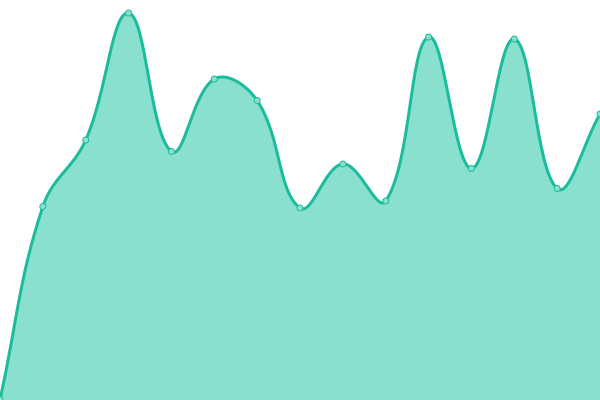

# [📈 Live Status](https://status.quickr.studio): <!--live status--> **🟧 Partial outage**

This repository contains the open-source uptime monitor and status page for [Quickr Studio](https://quickr.studio), powered by [Upptime](https://github.com/upptime/upptime).

With [Upptime](https://upptime.js.org), you can get your own unlimited and free uptime monitor and status page, powered entirely by a GitHub repository. We use [Issues](https://github.com/quickrstudio/upptime/issues) as incident reports, [Actions](https://github.com/quickrstudio/upptime/actions) as uptime monitors, and [Pages](https://status.quickr.studio) for the status page.

<!--start: status pages-->
<!-- This summary is generated by Upptime (https://github.com/upptime/upptime) -->
<!-- Do not edit this manually, your changes will be overwritten -->
<!-- prettier-ignore -->
| URL | Status | History | Response Time | Uptime |
| --- | ------ | ------- | ------------- | ------ |
|  [Astro](https://astro.quickr.studio) | 🟥 Down | [astro.yml](https://github.com/quickrstudio/upptime/commits/HEAD/history/astro.yml) | 

 156ms
     
 | 

<a href="https://status.quickr.studio/history/astro">100.00%</a>
    

|  Node 1 | 🟩 Up | [node-1.yml](https://github.com/quickrstudio/upptime/commits/HEAD/history/node-1.yml) | 

 545ms
     
 | 

<a href="https://status.quickr.studio/history/node-1">100.00%</a>
    

|  Node 2 | 🟩 Up | [node-2.yml](https://github.com/quickrstudio/upptime/commits/HEAD/history/node-2.yml) | 

 515ms
     
 | 

<a href="https://status.quickr.studio/history/node-2">100.00%</a>
    

<!--end: status pages-->

[**Visit our status website →**](https://status.quickr.studio)

## 📄 License

- Powered by: [Upptime](https://github.com/upptime/upptime)
- Code: [MIT](./LICENSE) © [Quickr Studio](https://quickr.studio)
- Data in the `./history` directory: [Open Database License](https://opendatacommons.org/licenses/odbl/1-0/)
